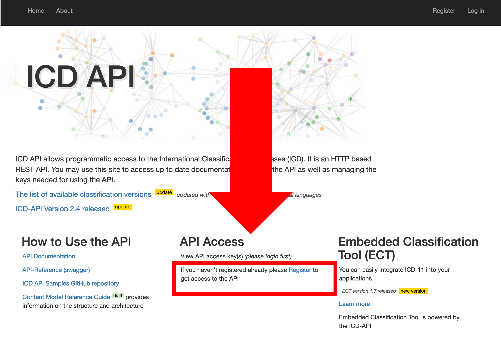
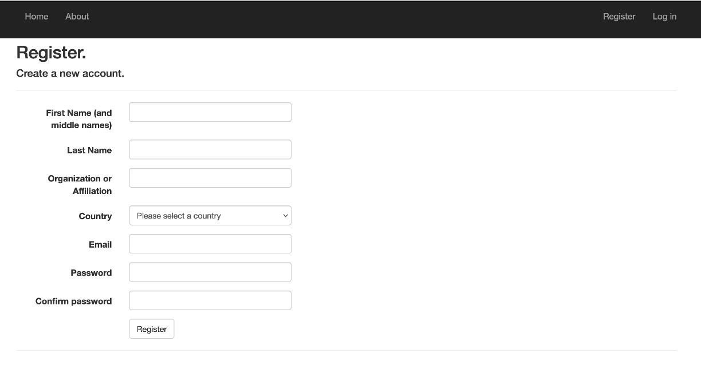

<!-- README.md is generated from README.Rmd. Please edit that file -->

```{r, include = FALSE}
knitr::opts_chunk$set(
  collapse = TRUE,
  comment = "#>",
  fig.path = "man/figures/README-",
  out.width = "100%"
)
```

# WHOicd

<!-- badges: start -->
[](https://CRAN.R-project.org/package=WHOicd)
[](https://lifecycle.r-lib.org/articles/stages.html#experimental)
[](https://app.codecov.io/gh/RodrigoZepeda/WHOicd?branch=main)
[](https://github.com/RodrigoZepeda/WHOicd/actions/workflows/R-CMD-check.yaml)
<!-- badges: end -->

Access the World Health Organization's (WHO) International Classification of Diseases (ICD) [API](https://icd.who.int/icdapi). This allows you to use ICD-10 and ICD-11 codes, encode text directly into ICD-11, search for diseases in ICD-10, and detect underlying causes of death using the [DORIS system](https://icd.who.int/doris). 

## Installation

You can install the development version of WHOicd using the `remotes` package:

``` r
#install.packages("remotes")
remotes::install_github("RodrigoZepeda/WHOicd")
```

## Setup

```{r, echo=FALSE}
CLIENT_ID <- Sys.getenv("CLIENT_ID")
CLIENT_SECRET <- Sys.getenv("CLIENT_SECRET")
```

For the examples we'll assume you already have a `CLIENT_ID` and `CLIENT_SECRET`
for the WHO API as obtained in the [**Obtaining your token**](#obtaining-your-token) section. 

To interact with the API you'll need to continuously create a token using the `get_token` function:

```{r}
library(WHOicd)

#Substitute CLIENT_ID and CLIENT_SECRET by your credentials
token <- get_token(CLIENT_ID, CLIENT_SECRET)
```

> **Note** These tokens last for 1 hour and once the hour passes you'll need to generate a new token. The package will try to auto-generate one for you. 

## ICD-11 examples

## ICD-10 examples

The main function relating to ICD-10 is `icd10_search()` which searches for the titles and parents of codes, blocks of chapters. As an example, we can search for the following vector and obtain a `data.frame`: 

```{r}
#Search for code, specific code, chapter and block 
codes <- c("D60", "IX", "I10-I15")
icd10_search(token, codes)
```

If you only want to get the title of the current code/chapter/block you can use `icd10_title` which is faster as it requires less requests to the API:

```{r}
#Search for code, specific code, chapter and block 
codes <- c("D60", "IX", "I10-I15")
icd10_title(token, codes)
```

#### Top-down search

Given a chapter you can also list all the blocks in a chapter

```{r}
icd10_blocks(token, chapter = "III")
```

As well as all of the chapters in a block:

```{r}
icd10_codes(token, block = "D55-D59")
```
The same command allows you to search inside a code:

```{r}
icd10_codes(token, block = "D55")
```

### Search for code in releases

Not all codes are available across releases. For example, the `C80.0` code was not in the `2008` release of the ICD-10. Hence if you are using that release you will not find it:

```{r}
icd10_search(token, "C80.0", release = 2008)
```

However you can use the `icd10_code_search_release` to search for a release containing that code:

```{r}
icd10_code_search_release(token, code = "C80.0")
```

and use one of those releases instead:

```{r}
icd10_search(token, "C80.0", release = 2016)
```

### Additional information on releases

The `icd10_releases` function lists all available ICD-10 releases

```{r}
icd10_releases(token)
```

The default is 2019. You can change it with the `release` parameter across all functions. 

To obtain the complete information on a certain release you can use the `icd10_release_info` function:

```{r}
icd10_release_info(token, release = 2016)
```


## DORIS (WHO Digital Open Rule Integrated Cause of Death Selection)

The [Digital Open Rule Integrated Cause of Death Selection](https://icd.who.int/doris/en), DORIS, 
provides a framework for obtaining the underlying cause of death from a death certificate. DORIS
functionality has been implemented in the `doris` function. 

The following example considers a 60 year old female whose primary cause of death was `2D42`: 
`Malignant neoplasms of ill-defined sites` due to `2E03`: `Malignant neoplasm metastasis in bone or bone marrow` due to `CB41.0Z`: `Acute respiratory failure, unspecified`. 

```{r}
doris(token, sex = "Female", age = iso_8601(years = 60), cause_of_death_code_a = "2D42",
      cause_of_death_code_b = "2E03", cause_of_death_code_c = "CB41.0Z")
```

All of the options are available in the function's help page [`doris()`](https://rodrigozepeda.github.io/WHOicd/reference/get_token.html). 

## Obtaining your token

Go to the WHO ICD API website at [https://icd.who.int/icdapi](https://icd.who.int/icdapi)
and click on `Register` inside the `API Access` section:



Fill out your information and verify your email. 



Once your email is verified go to the `Login` page. Enter your email and password:


Read and accept the terms and conditions for the API


Under **API Access** click on `View API access key(s)`


Your client id and secret will be required by the `WHOicd` library. Copy them, they are the equivalent to a user and password for this API. You'll need them to interact with the WHO ICD. **Don't share them!!**


## Support

This is not an official product of the WHO. However we are happy to provide support if you [raise an issue](https://docs.github.com/en/issues/tracking-your-work-with-issues/creating-an-issue). 


