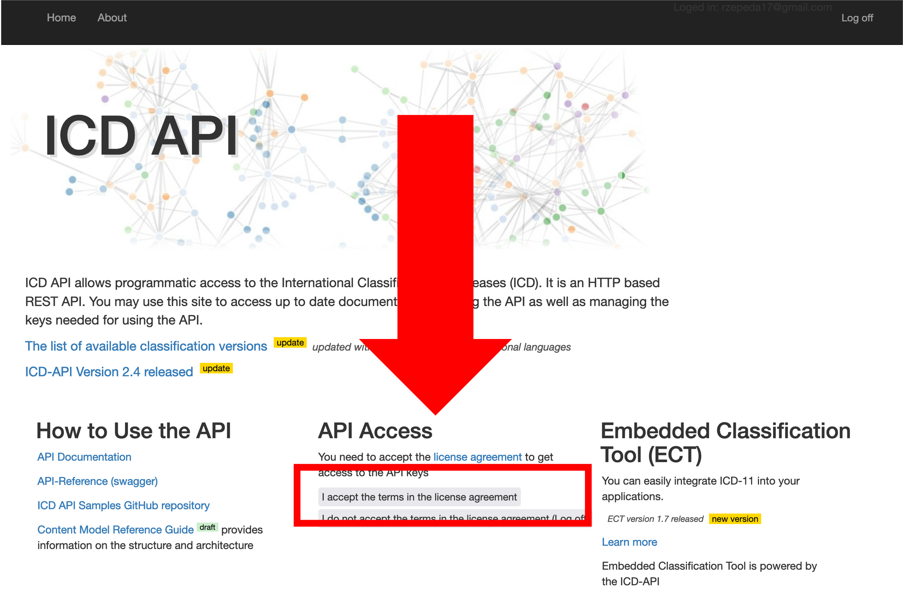

<!-- README.md is generated from README.Rmd. Please edit that file -->

```{r, include = FALSE}
knitr::opts_chunk$set(
  collapse = TRUE,
  comment = "#>",
  fig.path = "man/figures/README-",
  out.width = "100%"
)
```

# WHOicd

<!-- badges: start -->
[](https://CRAN.R-project.org/package=WHOicd)
[](https://lifecycle.r-lib.org/articles/stages.html#experimental)
<!-- badges: end -->

Access the World Health Organization's (WHO) International Classification of Diseases (ICD) [API](https://icd.who.int/icdapi). This allows you to use ICD-10 and ICD-11 codes, encode text directly into ICD-11, search for diseases in ICD-10, and detect underlying causes of death using the [DORIS system](https://icd.who.int/doris). 

## Installation

You can install the development version of WHOicd using the `remotes` package:

``` r
#install.packages("remotes")
remotes::install_github("RodrigoZepeda/WHOicd")
```

## Setup

```{r, echo=FALSE}
CLIENT_ID     <- Sys.getenv("CLIENT_ID")
CLIENT_SECRET <- Sys.getenv("CLIENT_SECRET")
```

For the examples we'll assume you already have a `CLIENT_ID` and `CLIENT_SECRET`
for the WHO API as obtained in the [**Obtaining your token**](#obtaining-your-token) section. 

To interact with the API you'll need to continuously create a token using the `get_token` function:

```{r}
library(WHOicd)
token <- get_token(CLIENT_ID, CLIENT_SECRET)
```

> **Note** These tokens last for 1 hour and once the hour passes you'll need to generate a new token. Don't worry, you'll receive a notification if you try to use it and its already expired. 

## ICD-11 examples

## ICD-10 examples

### Obtaining information on codes and blocks

#### Bottom-up search 

##### Search one value 

You can obtain all the information from a certain ICD-10 code using the `icd10_code_info` function:

```{r}
icd10_code_info(token, "M20")
```
Same information is available for blocks

```{r}
icd10_block_info(token, "M00-M25")
```
and for chapters:

```{r}
icd10_chapter_info(token, chapter = "VI")
```

##### Search one vector

Vectorized versions of those functions exist which allow the user to input a vector of codes
and obtain a `data.frame`:

```{r, message=FALSE}
icd10_code_info_vectorized(token, codes = c("E10", "M21","C00.1"))
```

Additionally for blocks and chapters the following are available:

```{r, results='hide', message=FALSE}
#For blocks
icd10_block_info_vectorized(token, blocks = c("E10-E14", "F10-F19", "C76-C80"))

#For chapters
icd10_chapter_info_vectorized(token, chapters = c("XII","II","V"))
```

##### Search from a data.frame (tidyverse)

Using the `tidy` functions you can search in a `data.frame` and create new columns
in the same data.frame.

As an example, consider the following which adds columns to chapters and blocks:

```{r, message=FALSE}
codes_df <- data.frame(
  Sex = c("M","F","F"), 
  icd10 = c("E14.1","C80.0","F14")
)

codes_df |>
  icd10_code_info_tidy("icd10", token)

```

Additionally for blocks and chapters the following are available:

```{r, results='hide', message=FALSE}
#For blocks
codes_df <- data.frame(Sex = c("M","F","F"), 
                       icd10_blocks = c("C76-C80","E10-E14","F10-F19"))
codes_df |>
     icd10_block_info_tidy("icd10_blocks", token, dry_run = TRUE)

#For chapters
codes_df <- data.frame(Sex = c("M","F","F"), 
                       icd10_chapters = c("II","IV","III"))
codes_df |>
     icd10_chapter_info_tidy("icd10_chapters", token, dry_run = TRUE)

```


#### Top-down search

Given a chapter you can also list all the blocks in a chapter

```{r}
icd10_blocks(token, chapter = "III")
```

As well as all of the chapters in a block:

```{r}
icd10_codes(token, block = "D55-D59")
```
The same command allows you to search inside a code:

```{r}
icd10_codes(token, block = "D55")
```

### Search for code in releases

Not all codes are available across releases. For example, the `C80.0` code was not in the `2008` release of the ICD-10. Hence if you are using that release you will not find it:

```{r}
icd10_code_info(token, code = "C80.0", release = 2008)
```

However you can use the `icd10_code_search_release` to search for a release containing that code:

```{r}
icd10_code_search_release(token, code = "C80.0")
```

and use one of those releases instead:

```{r}
icd10_code_info(token, code = "C80.0", release = 2016)
```

### Additional information on releases

The `icd10_releases` function lists all available ICD-10 releases

```{r}
icd10_releases(token)
```

The default is 2019. You can change it with the `release` parameter across all functions. 

To obtain the complete information on a certain release you can use the `icd10_release_info` function:

```{r}
icd10_release_info(token, release = 2016)
```


## Doris examples

## Obtaining your token

Go to the WHO ICD API website at [https://icd.who.int/icdapi](https://icd.who.int/icdapi)
and click on `Register` inside the `API Access` section:


Fill out your information and verify your email. 


Once your email is verified go to the `Login` page. Enter your email and password:


Read and accept the terms and conditions for the API



Under **API Access** click on `View API access key(s)`


Your client id and secret will be required by the `WHOicd` library. Copy them, they are the equivalent to a user and password for this API. You'll need them to interact with the WHO ICD. **Don't share them!!**


## Support

This is not an official product of the WHO. However we are happy to provide support if you [raise an issue](https://docs.github.com/en/issues/tracking-your-work-with-issues/creating-an-issue). 


