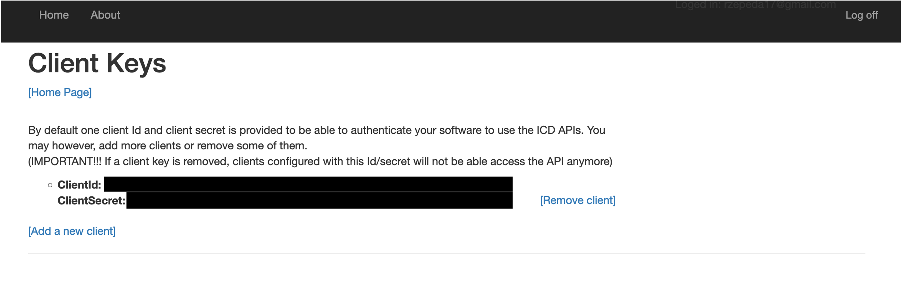

<!-- README.md is generated from README.Rmd. Please edit that file -->

# WHOicd

<!-- badges: start -->

[](https://CRAN.R-project.org/package=WHOicd)
[](https://lifecycle.r-lib.org/articles/stages.html#experimental)
[](https://app.codecov.io/gh/RodrigoZepeda/WHOicd?branch=main)
<!-- badges: end -->

Access the World Health Organization’s (WHO) International
Classification of Diseases (ICD) [API](https://icd.who.int/icdapi). This
allows you to use ICD-10 and ICD-11 codes, encode text directly into
ICD-11, search for diseases in ICD-10, and detect underlying causes of
death using the [DORIS system](https://icd.who.int/doris).

## Installation

You can install the development version of WHOicd using the `remotes`
package:

``` r
#install.packages("remotes")
remotes::install_github("RodrigoZepeda/WHOicd")
```

## Setup

For the examples we’ll assume you already have a `CLIENT_ID` and
`CLIENT_SECRET` for the WHO API as obtained in the [**Obtaining your
token**](#obtaining-your-token) section.

To interact with the API you’ll need to continuously create a token
using the `get_token` function:

``` r
library(WHOicd)
token <- get_token(CLIENT_ID, CLIENT_SECRET)
```

> **Note** These tokens last for 1 hour and once the hour passes you’ll
> need to generate a new token. Don’t worry, you’ll receive a
> notification if you try to use it and its already expired.

## ICD-11 examples

## ICD-10 examples

### Obtaining information on codes and blocks

#### Bottom-up search

##### Search one value

You can obtain all the information from a certain ICD-10 code using the
`icd10_code_info` function:

``` r
icd10_code_info(token, "M20")
#>                                                           code 
#>                                                          "M20" 
#>                                                     code_title 
#>                     "Acquired deformities of fingers and toes" 
#>                                                        block_1 
#>                                                      "M20-M25" 
#>                                                  block_title_1 
#>                                        "Other joint disorders" 
#>                                                          block 
#>                                                      "M00-M25" 
#>                                                    block_title 
#>                                                "Arthropathies" 
#>                                                        chapter 
#>                                                         "XIII" 
#>                                                  chapter_title 
#> "Diseases of the musculoskeletal system and connective tissue"
```

Same information is available for blocks

``` r
icd10_block_info(token, "M00-M25")
#>                                                          block 
#>                                                      "M00-M25" 
#>                                                    block_title 
#>                                                "Arthropathies" 
#>                                                        chapter 
#>                                                         "XIII" 
#>                                                  chapter_title 
#> "Diseases of the musculoskeletal system and connective tissue"
```

and for chapters:

``` r
icd10_chapter_info(token, chapter = "VI")
#>                          chapter                    chapter_title 
#>                             "VI" "Diseases of the nervous system"
```

##### Search one vector

Vectorized versions of those functions exist which allow the user to
input a vector of codes and obtain a `data.frame`:

``` r
icd10_code_info_vectorized(token, codes = c("E10", "M21", "C00.1"))
#> [1] "Searching code: E10"
#> [1] "Searching code: M21"
#> [1] "Searching code: C00.1"
#>   search_value code                          code_title   block
#> 1          E10  E10            Type 1 diabetes mellitus E10-E14
#> 2          M21  M21 Other acquired deformities of limbs M00-M25
#> 3        C00.1  C00           Malignant neoplasm of lip C00-C97
#>           block_title chapter
#> 1   Diabetes mellitus      IV
#> 2       Arthropathies    XIII
#> 3 Malignant neoplasms      II
#>                                                  chapter_title block_1
#> 1                Endocrine, nutritional and metabolic diseases    <NA>
#> 2 Diseases of the musculoskeletal system and connective tissue M20-M25
#> 3                                                    Neoplasms C00-C75
#>                                                                                                                      block_title_1
#> 1                                                                                                                             <NA>
#> 2                                                                                                            Other joint disorders
#> 3 Malignant neoplasms, stated or presumed to be primary, of specified sites, except of lymphoid, haematopoietic and related tissue
#>   code_1                           code_title_1 block_2
#> 1   <NA>                                   <NA>    <NA>
#> 2   <NA>                                   <NA>    <NA>
#> 3  C00.1 Malignant neoplasm: External lower lip C00-C14
#>                                         block_title_2
#> 1                                                <NA>
#> 2                                                <NA>
#> 3 Malignant neoplasms of lip, oral cavity and pharynx
```

Additionally for blocks and chapters the following are available:

``` r
# For blocks
icd10_block_info_vectorized(token, blocks = c("E10-E14", "F10-F19", "C76-C80"))

# For chapters
icd10_chapter_info_vectorized(token, chapters = c("XII", "II", "V"))
```

##### Search from a data.frame (tidyverse)

Using the `tidy` functions you can search in a `data.frame` and create
new columns in the same data.frame.

As an example, consider the following which adds columns to chapters and
blocks:

``` r
codes_df <- data.frame(
  Sex = c("M", "F", "F"),
  icd10 = c("E14.1", "C80.0", "F14")
)

codes_df |>
  icd10_code_info_tidy("icd10", token)
#> [1] "Searching code: E14.1"
#> [1] "Searching code: C80.0"
#> [1] "Searching code: F14"
#>   Sex icd10 code_1                                        code_title_1 code
#> 1   M E14.1  E14.1     Unspecified diabetes mellitus with ketoacidosis  E14
#> 2   F C80.0  C80.0 Malignant neoplasm, primary site unknown, so stated  C80
#> 3   F   F14   <NA>                                                <NA>  F14
#>                                               code_title   block
#> 1                          Unspecified diabetes mellitus E10-E14
#> 2      Malignant neoplasm, without specification of site C00-C97
#> 3 Mental and behavioural disorders due to use of cocaine F10-F19
#>                                                          block_title chapter
#> 1                                                  Diabetes mellitus      IV
#> 2                                                Malignant neoplasms      II
#> 3 Mental and behavioural disorders due to psychoactive substance use       V
#>                                   chapter_title block_1
#> 1 Endocrine, nutritional and metabolic diseases    <NA>
#> 2                                     Neoplasms C76-C80
#> 3              Mental and behavioural disorders    <NA>
#>                                                         block_title_1
#> 1                                                                <NA>
#> 2 Malignant neoplasms of ill-defined, secondary and unspecified sites
#> 3                                                                <NA>
```

Additionally for blocks and chapters the following are available:

``` r
# For blocks
codes_df <- data.frame(
  Sex = c("M", "F", "F"),
  icd10_blocks = c("C76-C80", "E10-E14", "F10-F19")
)
codes_df |>
  icd10_block_info_tidy("icd10_blocks", token, dry_run = TRUE)
#> Warning in .icd10_search_vectorized(searchvec = searchvec, searchfun =
#> searchfun, : No value of `searchvec` was found

# For chapters
codes_df <- data.frame(
  Sex = c("M", "F", "F"),
  icd10_chapters = c("II", "IV", "III")
)
codes_df |>
  icd10_chapter_info_tidy("icd10_chapters", token, dry_run = TRUE)
#> Warning in .icd10_search_vectorized(searchvec = searchvec, searchfun =
#> searchfun, : No value of `searchvec` was found
```

#### Top-down search

Given a chapter you can also list all the blocks in a chapter

``` r
icd10_blocks(token, chapter = "III")
#>     codes                                                          title
#> 1 D50-D53                                           Nutritional anaemias
#> 2 D55-D59                                            Haemolytic anaemias
#> 3 D60-D64                                    Aplastic and other anaemias
#> 4 D65-D69 Coagulation defects, purpura and other haemorrhagic conditions
#> 5 D70-D77               Other diseases of blood and blood-forming organs
#> 6 D80-D89               Certain disorders involving the immune mechanism
```

As well as all of the chapters in a block:

``` r
icd10_codes(token, block = "D55-D59")
#>   codes                                title
#> 1   D55      Anaemia due to enzyme disorders
#> 2   D56                         Thalassaemia
#> 3   D57                Sickle-cell disorders
#> 4   D58 Other hereditary haemolytic anaemias
#> 5   D59          Acquired haemolytic anaemia
```

The same command allows you to search inside a code:

``` r
icd10_codes(token, block = "D55")
#>   codes                                                              title
#> 1 D55.0 Anaemia due to glucose-6-phosphate dehydrogenase [G6PD] deficiency
#> 2 D55.1           Anaemia due to other disorders of glutathione metabolism
#> 3 D55.2                     Anaemia due to disorders of glycolytic enzymes
#> 4 D55.3                  Anaemia due to disorders of nucleotide metabolism
#> 5 D55.8                             Other anaemias due to enzyme disorders
#> 6 D55.9                        Anaemia due to enzyme disorder, unspecified
```

### Search for code in releases

Not all codes are available across releases. For example, the `C80.0`
code was not in the `2008` release of the ICD-10. Hence if you are using
that release you will not find it:

``` r
icd10_code_info(token, code = "C80.0", release = 2008)
#> Warning in value[[3L]](cond): ICD-10 code possibly not found
#> [1] NA
```

However you can use the `icd10_code_search_release` to search for a
release containing that code:

``` r
icd10_code_search_release(token, code = "C80.0")
#> [1] "2019" "2016" "2010"
```

and use one of those releases instead:

``` r
icd10_code_info(token, code = "C80.0", release = 2016)
#>                                                                code_1 
#>                                                               "C80.0" 
#>                                                          code_title_1 
#>                 "Malignant neoplasm, primary site unknown, so stated" 
#>                                                                  code 
#>                                                                 "C80" 
#>                                                            code_title 
#>                   "Malignant neoplasm, without specification of site" 
#>                                                               block_1 
#>                                                             "C76-C80" 
#>                                                         block_title_1 
#> "Malignant neoplasms of ill-defined, secondary and unspecified sites" 
#>                                                                 block 
#>                                                             "C00-C97" 
#>                                                           block_title 
#>                                                 "Malignant neoplasms" 
#>                                                               chapter 
#>                                                                  "II" 
#>                                                         chapter_title 
#>                                                           "Neoplasms"
```

### Additional information on releases

The `icd10_releases` function lists all available ICD-10 releases

``` r
icd10_releases(token)
#> [1] "2019" "2016" "2010" "2008"
```

The default is 2019. You can change it with the `release` parameter
across all functions.

To obtain the complete information on a certain release you can use the
`icd10_release_info` function:

``` r
icd10_release_info(token, release = 2016)
#>                                                                                                                    context 
#>                                                                   "http://id.who.int/icd/contexts/contextForTopLevel.json" 
#>                                                                                                                         id 
#>                                                                                    "http://id.who.int/icd/release/10/2016" 
#>                                                                                                             title.language 
#>                                                                                                                       "en" 
#>                                                                                                                title.value 
#> "International Statistical Classification of Diseases and Related Health Problems 10th Revision (ICD-10) Version for 2016" 
#>                                                                                                                releaseDate 
#>                                                                                                               "2016-11-01" 
#>                                                                                                                 browserUrl 
#>                                                                 "http://apps.who.int/classifications/icd10/browse/2016/en"
```

## Doris examples

## Obtaining your token

Go to the WHO ICD API website at <https://icd.who.int/icdapi> and click
on `Register` inside the `API Access` section:

<figure>

<figcaption aria-hidden="true">Image of the ICD API website indicating
where the Register button for the API lies</figcaption>
</figure>

Fill out your information and verify your email.

<figure>

<figcaption aria-hidden="true">Image of the API website with the
register form</figcaption>
</figure>

Once your email is verified go to the `Login` page. Enter your email and
password:

<figure>

<figcaption aria-hidden="true">API login page requesting the user for
email and password</figcaption>
</figure>

Read and accept the terms and conditions for the API

<figure>

<figcaption aria-hidden="true">Image of API website indicating where is
the button to accept terms and conditions</figcaption>
</figure>

Under **API Access** click on `View API access key(s)`

 Your client id and secret will be
required by the `WHOicd` library. Copy them, they are the equivalent to
a user and password for this API. You’ll need them to interact with the
WHO ICD. **Don’t share them!!**

<figure>

<figcaption aria-hidden="true">Image of API website indicating where is
the button to View the API access keys</figcaption>
</figure>

## Support

This is not an official product of the WHO. However we are happy to
provide support if you [raise an
issue](https://docs.github.com/en/issues/tracking-your-work-with-issues/creating-an-issue).
