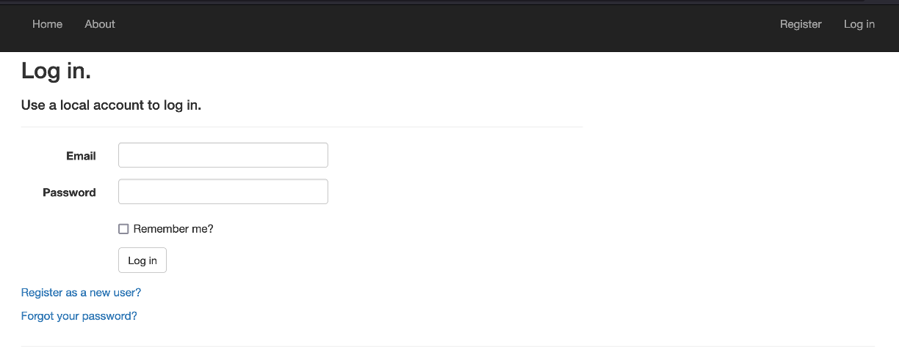
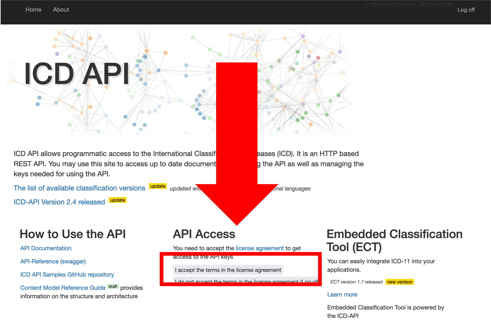

```{r, include = FALSE}
knitr::opts_chunk$set(
  collapse = TRUE,
  comment = "#>"
)

CLIENT_ID <- Sys.getenv("CLIENT_ID")
CLIENT_SECRET <- Sys.getenv("CLIENT_SECRET")
```

To be able to use the package you'll need a `CLIENT_ID` and `CLIENT_SECRET` from the WHO website. Follow these instructions to obtain it: 

1. Go to the WHO ICD API website at [https://icd.who.int/icdapi](https://icd.who.int/icdapi)
and click on `Register` inside the `API Access` section:


2. Fill out your information and verify your email. 


3. Once your email is verified go to the `Login` page. Enter your email and password:



4. Read and accept the terms and conditions for the API



5. Under **API Access** click on `View API access key(s)`


6. Your client id and secret will be required by the `WHOicd` library. Copy them, they are the equivalent to a user and password for this API. You'll need them to interact with the WHO ICD. **Don't share them!!**


7. Now go back to R and use them!

```{r setup}
library(WHOicd)

#Substitute for your ID and SECRET
token <- get_token(CLIENT_ID, CLIENT_SECRET)

#Check that they work by searching all ICD-10 releases
icd10_releases(token)
```
